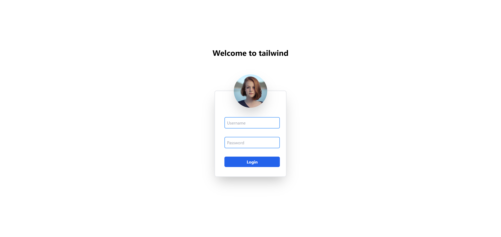

"# tailwind"

npm init -y
npm install -D tailwindcss
npx tailwindcss init

update  tailwind.config.js

/** @type {import('tailwindcss').Config} */
module.exports = {
  content: ["./src/**/*.{html,js}"],
  theme: {
    extend: {},
  },
  plugins: [],
}

create main.css and update

@tailwind base;
@tailwind components;
@tailwind utilities;

run watch comman

npx tailwindcss -i ./main.css -o ./style.css --watch

run npm live server

open <http://localhost:5500/>

Day 1  

Day 3

Day 4

